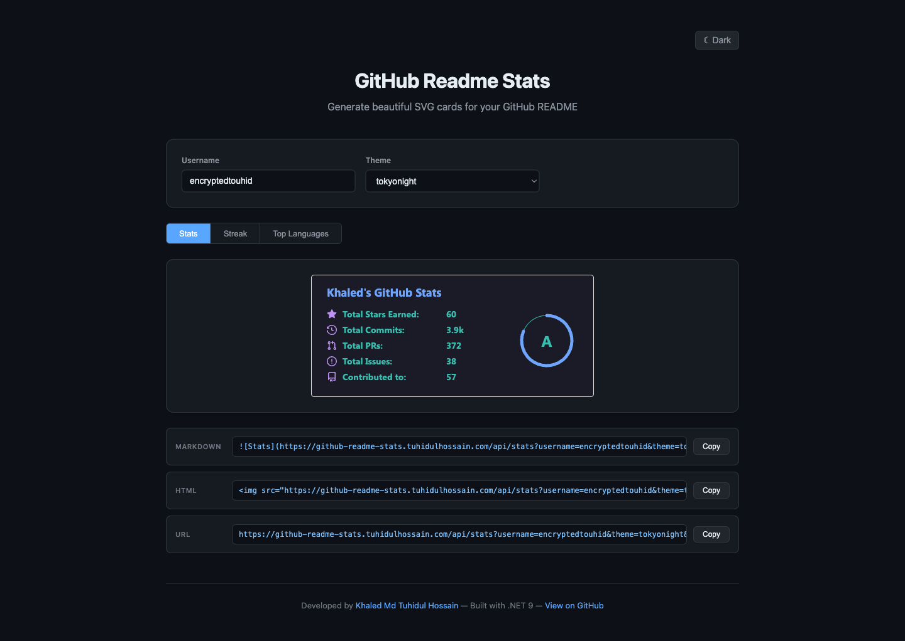

# GitHub Readme Stats

A high-performance .NET 9 Web API that generates beautiful, customizable SVG cards displaying GitHub user and repository statistics — perfect for embedding in your README.

[](https://github-readme-stats.tuhidulhossain.com/)
[](https://dotnet.microsoft.com/)
[](LICENSE)

---

## Live Preview

Try it out at **[github-readme-stats.tuhidulhossain.com](https://github-readme-stats.tuhidulhossain.com/)** — enter any GitHub username, pick a theme, and get your embed code instantly.



---

## Features

- **Streak Stats Card** — Current streak, longest streak, and total contributions with animated SVG
- **User Stats Card** — Stars, commits, PRs, issues, reviews, and rank with a visual ring
- **Top Languages Card** — Most used programming languages with multiple layout options
- **Repository Pin Card** — Showcase pinned repositories with stars, forks, and language info
- **Gist Card** — Display gist statistics
- **60+ Themes** — GitHub, editor, framework, and custom color themes
- **Fully Customizable** — Colors, borders, layouts, animations, and more
- **High Performance** — Redis caching, rate limiting, token rotation, and resilience patterns

---

## Quick Start

Add any of these to your GitHub README:

### Streak Stats

```markdown

```
<div align="center">
  
</div>

### User Stats

```markdown

```

<div align="center">
  
</div>


### Top Languages

```markdown

```
<div align="center">
  
</div>

### Repository Pin

```markdown

```

### Gist Card

```markdown

```

---

## API Reference

### Endpoints

| Endpoint | Description |
|----------|-------------|
| `/api/stats?username={user}` | User statistics card |
| `/api/streak?username={user}` | Streak statistics card |
| `/api/top-langs?username={user}` | Top languages card |
| `/api/pin?username={user}&repo={repo}` | Repository pin card |
| `/api/gist?id={gist_id}` | Gist card |
| `/health` | Health check |

### Common Parameters

These parameters work across all card types:

| Parameter | Description | Default |
|-----------|-------------|---------|
| `theme` | Card theme (see [Themes](#themes)) | `default` |
| `hide_border` | Hide the card border | `false` |
| `border_radius` | Card corner radius | `4.5` |
| `title_color` | Title color (hex without `#`) | theme default |
| `text_color` | Body text color | theme default |
| `icon_color` | Icon color | theme default |
| `bg_color` | Background color | theme default |
| `border_color` | Border color | theme default |
| `cache_seconds` | Cache duration in seconds | `1800` |
| `locale` | Locale for card text | `en` |

### Stats Card Parameters

| Parameter | Description | Default |
|-----------|-------------|---------|
| `show_icons` | Show icons next to stats | `false` |
| `hide_title` | Hide the card title | `false` |
| `hide_rank` | Hide the rank circle | `false` |
| `include_all_commits` | Count all commits (not just current year) | `false` |
| `commits_year` | Show commits for a specific year | current year |
| `line_height` | Line height between stats | auto |
| `card_width` | Card width in pixels | auto |
| `hide` | Comma-separated stats to hide (e.g. `stars,commits`) | - |
| `show` | Show additional stats: `prs_merged`, `discussions_started`, `discussions_answered` | - |
| `ring_color` | Rank ring color | theme default |
| `text_bold` | Bold text for stats | `true` |
| `number_format` | Number format: `short` or `long` | `short` |
| `rank_icon` | Rank icon style: `default`, `github`, `percentile` | `default` |
| `exclude_repo` | Comma-separated repos to exclude | - |
| `disable_animations` | Disable all animations | `false` |

### Streak Card Parameters

| Parameter | Description | Default |
|-----------|-------------|---------|
| `ring_color` | Ring color | theme default |
| `fire_color` | Fire icon color | theme default |
| `stroke_color` | Stroke/divider color | theme default |
| `curr_streak_num_color` | Current streak number color | theme default |
| `side_nums_color` | Side numbers color | theme default |
| `curr_streak_label_color` | Current streak label color | theme default |
| `side_labels_color` | Side labels color | theme default |
| `dates_color` | Date text color | theme default |
| `date_format` | Date format string | `M j[, Y]` |
| `card_width` | Card width in pixels | auto |
| `card_height` | Card height in pixels | auto |
| `hide_total_contributions` | Hide total contributions section | `false` |
| `hide_current_streak` | Hide current streak section | `false` |
| `hide_longest_streak` | Hide longest streak section | `false` |
| `starting_year` | Start counting from a specific year | account creation |
| `disable_animations` | Disable all animations | `false` |

### Top Languages Card Parameters

| Parameter | Description | Default |
|-----------|-------------|---------|
| `layout` | Layout: `normal`, `compact`, `donut`, `donut-vertical`, `pie` | `normal` |
| `langs_count` | Number of languages to show | `5` |
| `hide` | Comma-separated languages to hide | - |
| `exclude_repo` | Comma-separated repos to exclude | - |
| `size_weight` | Weight for language size | `1` |
| `count_weight` | Weight for language count | `0` |
| `hide_progress` | Hide progress bars | `false` |
| `hide_title` | Hide the card title | `false` |
| `custom_title` | Custom card title | - |
| `card_width` | Card width in pixels | auto |
| `stats_format` | Format: `percentages` or `bytes` | `percentages` |
| `disable_animations` | Disable all animations | `false` |

### Repository Pin Card Parameters

| Parameter | Description | Default |
|-----------|-------------|---------|
| `show_owner` | Show the repo owner's name | `false` |
| `description_lines_count` | Number of description lines | auto |

### Gist Card Parameters

| Parameter | Description | Default |
|-----------|-------------|---------|
| `hide_title` | Hide the gist title | `false` |
| `show_owner` | Show the gist owner | `false` |

---

## Themes

Use the `theme` parameter to customize your card appearance:

```markdown

```

### Theme Previews

| Theme | Preview |
|-------|---------|
| `github_light` |  |
| `github_dark` |  |
| `tokyonight` |  |
| `dracula` |  |
| `nord` |  |
| `radical` |  |
| `sunset_dark` |  |
| `ocean_deep` |  |
| `cyber` |  |
| `aurora` |  |

### All Available Themes

<details>
<summary><strong>GitHub Themes</strong></summary>

| Theme | Description |
|-------|-------------|
| `github_light` | GitHub light mode |
| `github_light_default` | GitHub light with gray titles |
| `github_light_high_contrast` | GitHub light high contrast |
| `github_light_colorblind` | GitHub light colorblind-friendly |
| `github_light_tritanopia` | GitHub light tritanopia-friendly |
| `github_dark` | GitHub dark mode |
| `github_dark_default` | GitHub dark with white titles |
| `github_dark_high_contrast` | GitHub dark high contrast |
| `github_dark_dimmed` | GitHub dimmed dark |
| `github_dark_colorblind` | GitHub dark colorblind-friendly |
| `github_dark_tritanopia` | GitHub dark tritanopia-friendly |

</details>

<details>
<summary><strong>Popular Themes</strong></summary>

| Theme | Description |
|-------|-------------|
| `default` | Light theme with blue accent |
| `dark` | Pure dark theme |
| `radical` | Pink/purple gradient |
| `tokyonight` | Tokyo Night color scheme |
| `dracula` | Dracula purple theme |
| `nord` | Nord arctic colors |
| `gruvbox` | Retro groove colors |
| `onedark` | Atom One Dark theme |
| `catppuccin_mocha` | Catppuccin Mocha |
| `catppuccin_latte` | Catppuccin Latte |
| `rose_pine` | Rose Pine theme |

</details>

<details>
<summary><strong>Editor Themes</strong></summary>

| Theme | Description |
|-------|-------------|
| `monokai` | Monokai editor theme |
| `cobalt` | Cobalt blue theme |
| `cobalt2` | Cobalt2 theme |
| `nightowl` | Night Owl editor theme |
| `material-palenight` | Material Palenight |
| `darcula` | JetBrains Darcula |
| `one_dark_pro` | One Dark Pro |
| `ayu-mirage` | Ayu Mirage theme |
| `noctis_minimus` | Noctis Minimus |
| `synthwave` | 80s synthwave style |

</details>

<details>
<summary><strong>Framework & Brand Themes</strong></summary>

| Theme | Description |
|-------|-------------|
| `vue` | Vue.js green theme |
| `vue-dark` | Dark Vue.js theme |
| `react` | React brand colors |
| `swift` | Swift orange theme |
| `algolia` | Algolia brand colors |
| `discord_old_blurple` | Discord old blurple |
| `buefy` | Buefy framework colors |

</details>

<details>
<summary><strong>Color Palette Themes</strong></summary>

| Theme | Description |
|-------|-------------|
| `solarized-dark` | Solarized dark palette |
| `solarized-light` | Solarized light palette |
| `gruvbox_light` | Light gruvbox variant |
| `shades-of-purple` | Purple shades theme |
| `midnight-purple` | Midnight purple theme |
| `blue-green` | Blue-green gradient |
| `blue_navy` | Navy blue theme |
| `calm` | Calm pastel colors |
| `calm_pink` | Calm pink pastel |
| `rose` | Rose pink theme |

</details>

<details>
<summary><strong>Streak Card Exclusive Themes</strong></summary>

Modern themes designed specifically for the streak card:

| Theme | Description |
|-------|-------------|
| `sunset` | Warm sunset gradient |
| `sunset_dark` | Dark sunset variant |
| `ocean` | Ocean blue theme |
| `ocean_deep` | Deep ocean theme |
| `forest` | Forest green theme |
| `forest_dark` | Dark forest variant |
| `purple_wave` | Purple wave gradient |
| `purple_galaxy` | Galaxy purple theme |
| `cyber` | Cyberpunk neon |
| `fire` | Fire red/orange theme |
| `mint` | Fresh mint green |
| `coral` | Coral pink theme |
| `aurora` | Purple/teal aurora |
| `golden` | Golden luxury theme |
| `golden_dark` | Dark gold variant |
| `rose_gold` | Rose gold elegant |
| `electric` | Electric blue theme |
| `lavender` | Soft lavender |
| `arctic` | Arctic ice blue |

</details>

<details>
<summary><strong>All Other Themes</strong></summary>

| Theme | Description |
|-------|-------------|
| `default_repocard` | Light theme for repo cards |
| `merko` | Green forest theme |
| `highcontrast` | High contrast dark |
| `prussian` | Prussian blue theme |
| `great-gatsby` | Great Gatsby gold |
| `bear` | Bear app theme |
| `chartreuse-dark` | Chartreuse dark theme |
| `gotham` | Gotham dark theme |
| `graywhite` | Gray and white minimal |
| `vision-friendly-dark` | Accessible dark theme |
| `flag-india` | India flag colors |
| `omni` | Omni dark theme |
| `jolly` | Jolly bright theme |
| `maroongold` | Maroon and gold |
| `yeblu` | Yellow and blue |
| `blueberry` | Blueberry colors |
| `slateorange` | Slate and orange |
| `kacho_ga` | Japanese aesthetic |
| `outrun` | Outrun retro style |
| `ocean_dark` | Deep ocean dark |
| `city_lights` | City lights theme |
| `aura_dark` | Aura dark theme |
| `panda` | Panda syntax theme |
| `aura` | Aura purple theme |
| `apprentice` | Apprentice vim theme |
| `moltack` | Moltack colors |
| `codeSTACKr` | codeSTACKr theme |
| `date_night` | Date night romantic |
| `holi` | Holi festival colors |
| `neon` | Cyan/magenta cyberpunk |
| `ambient_gradient` | Ambient gradient |

</details>

---

## Self-Hosting

### Prerequisites

- [.NET 9.0 SDK](https://dotnet.microsoft.com/download/dotnet/9.0)
- A [GitHub Personal Access Token](https://github.com/settings/tokens)
- Redis (optional — falls back to in-memory cache)

### Setup

1. **Clone the repository**

```bash
git clone https://github.com/encryptedtouhid/github-readme-stats.git
cd github-readme-stats
```

2. **Configure your GitHub token**

Create `src/GitHubStats.Api/appsettings.Development.json`:

```json
{
  "GitHub": {
    "PersonalAccessTokens": ["ghp_your_token_here"]
  }
}
```

Or set the environment variable:

```bash
export GitHub__PersonalAccessTokens__0=ghp_your_token_here
```

3. **Build and run**

```bash
cd src
dotnet build GitHubStats.sln
cd GitHubStats.Api
dotnet run
```

The API will be available at `http://localhost:5042`.

4. **Run tests**

```bash
cd src
dotnet test GitHubStats.Tests
```

### Configuration

Configure via `appsettings.json` or environment variables:

| Setting | Description | Default |
|---------|-------------|---------|
| `GitHub:PersonalAccessTokens` | GitHub PAT(s) for API access | required |
| `GitHub:MaxRetries` | Max retry attempts for API calls | `3` |
| `GitHub:TimeoutSeconds` | API request timeout | `30` |
| `Cache:RedisConnectionString` | Redis connection string | `null` (in-memory) |
| `Cache:StatsCardTtlSeconds` | Stats card cache TTL | `86400` (1 day) |
| `Cache:TopLangsCardTtlSeconds` | Top languages cache TTL | `518400` (6 days) |
| `Cache:PinCardTtlSeconds` | Pin card cache TTL | `864000` (10 days) |
| `Cache:GistCardTtlSeconds` | Gist card cache TTL | `172800` (2 days) |

---

## Architecture

```
src/
├── GitHubStats.Api             # HTTP endpoints, middleware, and startup
├── GitHubStats.Application     # Business logic and card service orchestration
├── GitHubStats.Domain          # Entities, interfaces, and domain services
├── GitHubStats.Infrastructure  # GitHub API client, caching, and token rotation
├── GitHubStats.Rendering       # SVG card rendering and 60+ theme definitions
└── GitHubStats.Tests           # Unit and integration tests
```

**Key design decisions:**
- Clean architecture with clear separation of concerns
- GitHub GraphQL API for efficient data fetching with REST fallback for commit counts
- Token rotation across multiple PATs for rate limit distribution
- Polly resilience patterns (retries, circuit breaker, timeouts)
- Background cache refresh job for tracked users
- OpenTelemetry instrumentation for observability

---

## License

[MIT](LICENSE)

---

**Developed by [Khaled Md Tuhidul Hossain](https://tuhidulhossain.com/)**
